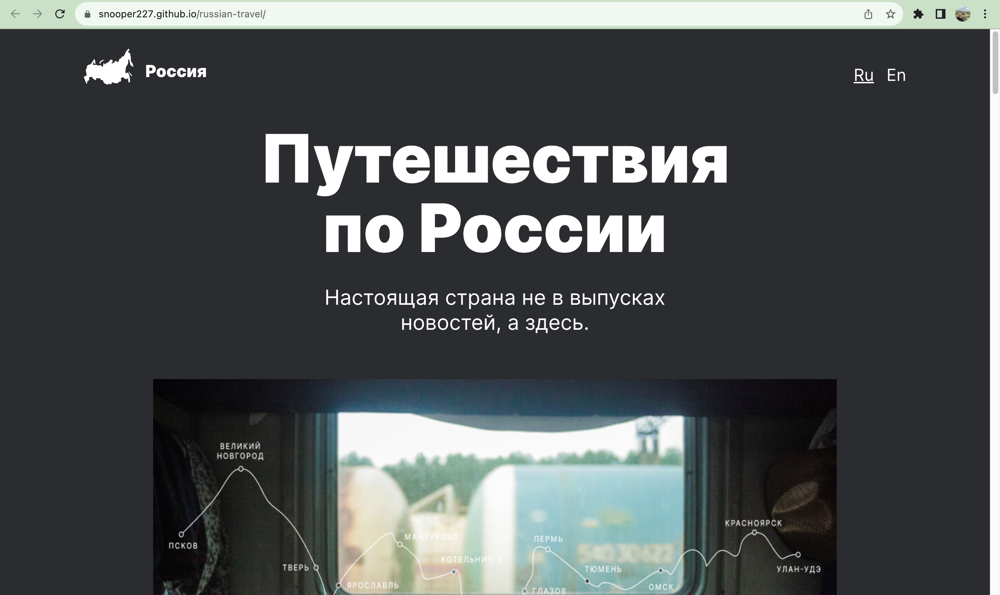
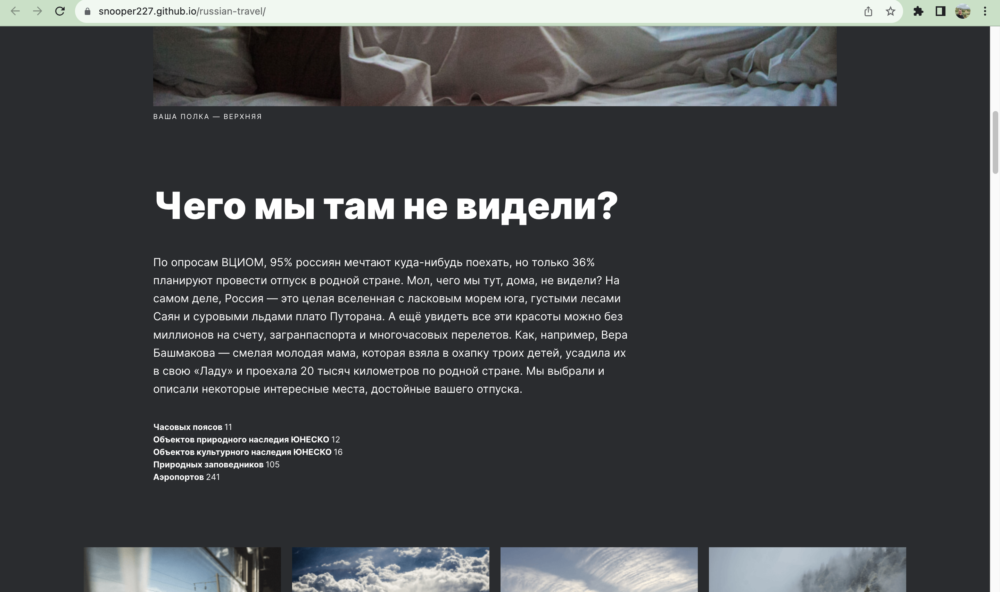
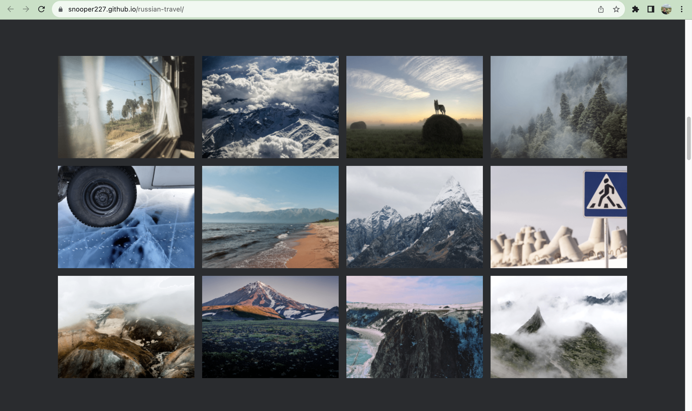
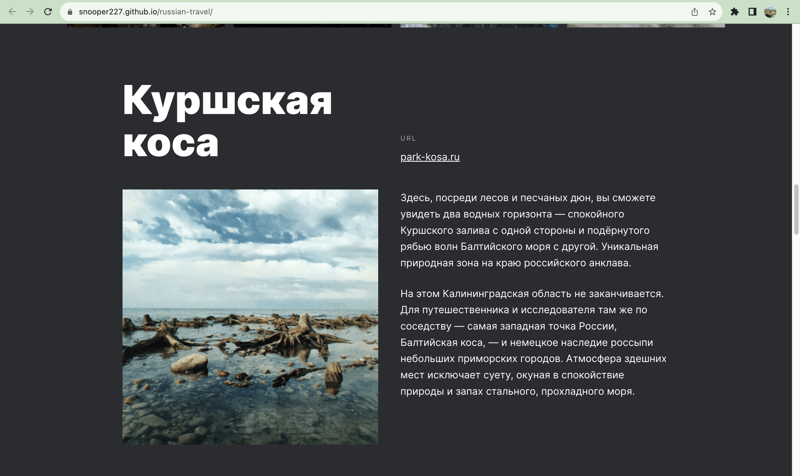
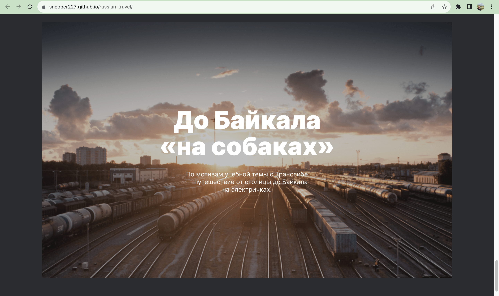
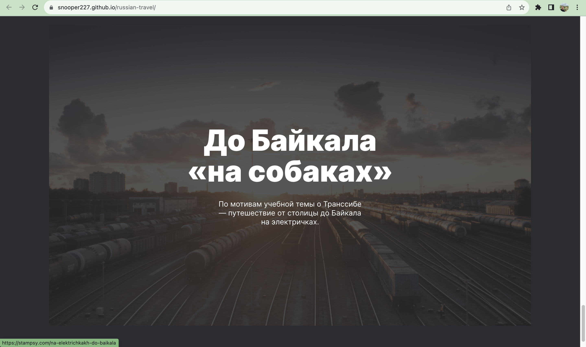
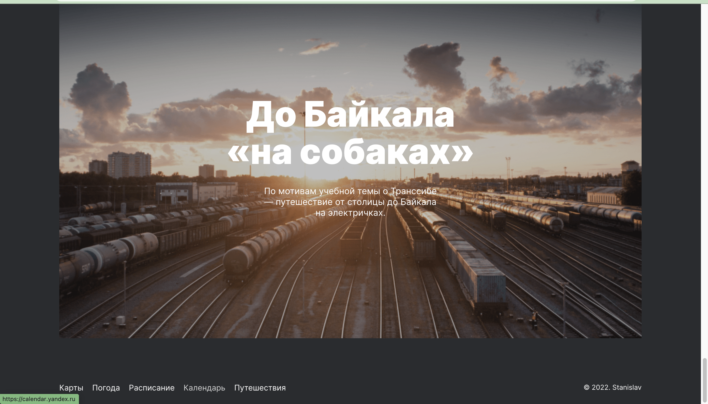

<h1 align="center" >Проект: Путешествия по России</h1>

<h2 align="center" >Обзор</h2>

Figma

Адаптивная верстка

Создание публичного сайта

<h2 align="center" >О проекте</h2>

Здесь о путешествии по России.
Была проделана работа с макетом на Фигма, в котором видно, как проект должен выглядеть на самых распространённых разрешениях экранов.
Этот был проект сложнее предыдущих, но интереснее.

<h2 align="center" >Картинки</h3>

<h2>Ссылка на проект</h2>
<a href='https://snooper227.github.io/russian-travel/' target='_blank'>Russian-Travel</a>
